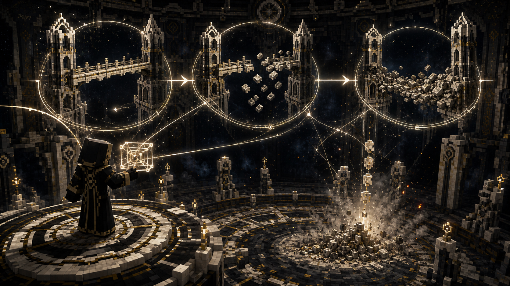

# Stage 03 — Exception of Sequence

## Purpose

Design and deliver the Continuance mastery ordeal that proves the player can
capture an event, preserve its obligations, and conclude it without rejecting
an unfavorable consequence. Its output is the **Exception of Sequence**.

## Player Promise

The player demonstrates that Continuance is not free repetition or undo. A
captured event retains its subjects, cost, result, and Closure obligation.

## Required Design

- Entry requires the Manuscript of Continuance at Authorship.
- The ordeal occurs in a bounded Worldline location with deterministic reset
  behavior.
- The player must capture a declared event, allow its expected order to become
  disrupted, and restore an honest conclusion.
- Completion requires accepting at least one meaningful consequence rather
  than deleting or redirecting every cost.
- The visual grammar of path, declaration, capture, delayed consequence, and
  conclusion must be the same grammar reused in Yaldabaoth's third Claim.
- Failure cannot leave free duplicated drops, repeated advancement credit,
  permanent damage loops, or orphaned delayed events.

## Progression Contract

The Exception is unique, owner-bound, recoverable, and atomically consumed by
the Broker exchange.

Granting it should produce:

> What follows may wait. It may not become nothing.

## Design Gate

A focused design pass must select the event, location, consequence, capture
interface, and Closure action. It must test causal responsibility rather than
simple memorization of a sequence.

## Verification

- Only players with Continuance Authorship can begin or complete the ordeal.
- Captured event state persists safely through a normal save.
- Failure, logout, death, or invalid restoration cancels the event and resets
  the location without rewards.
- No event can resolve more times than its design permits.
- Duplicate completion cannot duplicate the Exception.

## Handoff

Establishes the sequence telegraphs consumed by
[Stage 11](11-claim-no-consequence.md) and produces the final proof for
[Stage 04](04-writ-and-firmament-entry.md).
