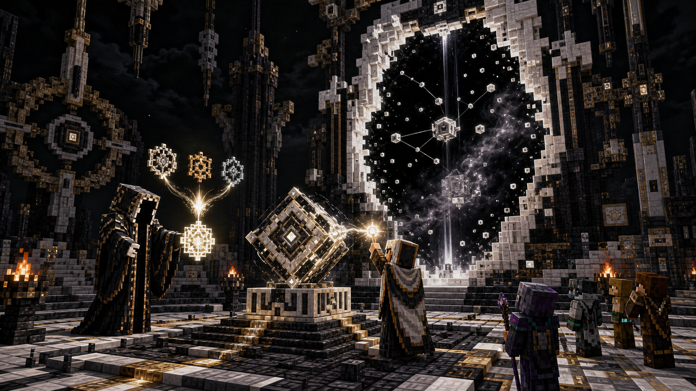

# Stage 04 — Writ and Firmament Entry

## Purpose

Converge the three mastery proofs into one singular Broker exchange and provide
the controlled entry path to the First Firmament.

## Broker Exchange

The Broker recognizes a player who owns all three Exceptions. The exchange is
all-or-nothing:

1. Revalidate ownership of Distance, Identity, and Sequence.
2. Reserve all three proof states.
3. Remove their physical representations.
4. Mark the proofs as exchanged.
5. Grant the **Writ of No Authority**.

If any step cannot complete, restore all three proofs and grant no Writ. The
exchange is singular per player and is not a repeatable shop recipe.

The Writ is owner-bound and recoverable. It is an entry credential, not a
consumable boss summon.

## Observatory Activation

Using the Writ on the designated Tesseract at the Unwritten Observatory opens
a portal and begins a short join window.

- The Writ bearer becomes encounter owner.
- Other players opt in by entering the portal before the window closes.
- Nobody is pulled or teleported automatically.
- The owner must satisfy original or rematch eligibility when the roster
  locks.
- Participants already committed to another Firmament encounter are rejected.
- Once locked, the roster cannot gain new members during that attempt.

The original prompt is **Enter the First Firmament**. After the owner has
defeated the original, activation offers **Reconstruct the First Error** and
creates a projection variant.

## Failure Rules

- An unavailable arena leaves the portal closed and preserves all state.
- Failure or wipe never consumes the Writ.
- If the owner leaves before roster lock, the portal closes without allocating
  an encounter.
- If a participant becomes invalid before lock, only that participant is
  rejected.
- Portal state and encounter allocation must commit atomically.

## Verification

- The Broker cannot exchange missing, duplicated, or foreign proofs.
- Crash-safe exchange recovery never loses or duplicates proofs and Writs.
- Portal joining is opt-in and roster locking is deterministic.
- Original and projection variants are selected from persistent first-clear
  state.
- A failed attempt can be reopened without reacquiring the Writ.

## Handoff

Consumes the outputs of Stages 01–03 and requests an arena from
[Stage 05](05-first-firmament-runtime.md).
