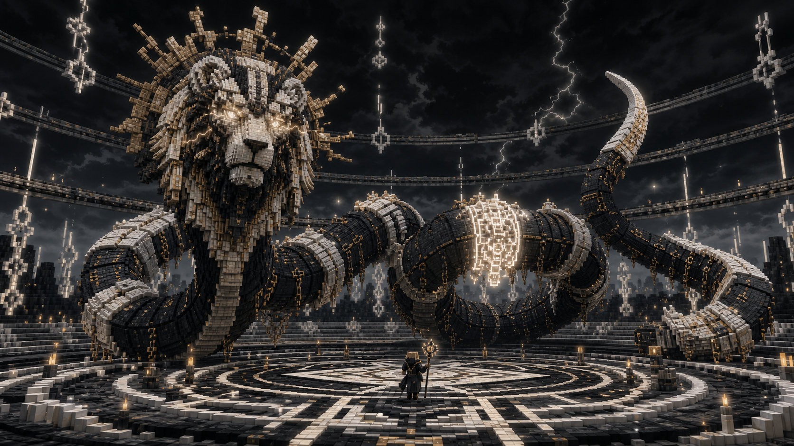

# Stage 06 — Yaldabaoth Foundation

## Purpose

Create the authoritative boss entity, multipart body, shared health model, base
presentation, and encounter-state contracts used by all three acts.

## Entity Model

Yaldabaoth is one server entity with one health pool and named multipart
hitboxes for:

- Lion head and mane.
- Neck transition.
- A configurable chain of serpent body segments.
- Tail and terminal sweep segment.

Parts do not pathfind, save, or drop loot independently. They forward valid
damage and interaction to the parent. Missing or invalid parent linkage
discards parts and asks the encounter controller to recover.

Ordinary segments accept reduced damage. The controller can mark specific
segments as contradictions; those parts accept a higher multiplier and
transfer damage to shared health. Head vulnerability is phase-controlled.

## State Contracts

Use authoritative concepts equivalent to:

- `EncounterVariant { ORIGINAL, PROJECTION }`
- `EncounterPhase { CELESTIALS, CLAIMS, REVOCATION, COMPLETE, RESETTING }`
- `ExceptionKind { RELATION, DEFINITION, CONTINUANCE }`

Synced presentation state includes phase, active Claim mask, current Edict,
contradiction parts, crown state, target, attack telegraph, and variant.

## Base Combat and Movement

Before stage-specific attacks, the boss must support:

- Coiling around the arena boundary.
- Passing segments through the arena on declared paths.
- Tail sweep with a geometric ground telegraph.
- Lion roar with directionally reversible knockback.
- Burrow/withdraw and re-entry points owned by the controller.
- Stable targeting across solo and party play.

No base attack may bypass the minimum 1.25-second warning contract.

## Original Presentation

The original uses muted gold, bone, ember, and storm-dark materials. The lion
mane resembles a damaged solar corona; eyes flash like contained lightning.
Motion favors long stillness followed by precise discontinuity. The body must
remain readable as a single long serpent rather than a train of mobs.

## Verification

- Damage forwarding cannot multiply one hit across overlapping parts.
- Removed, unloaded, or reconstructed parts preserve shared health correctly.
- Segment transforms remain attached during coils, sweeps, and teleport-like
  discontinuities.
- Dedicated servers never load client renderer classes.
- Boss persistence recovers cleanly or triggers arena recovery.
- Original variant assets do not depend on projection shaders.

## Handoff

Provides the boss and controller contracts required by
[Stage 07](07-celestial-foundations.md) onward.
