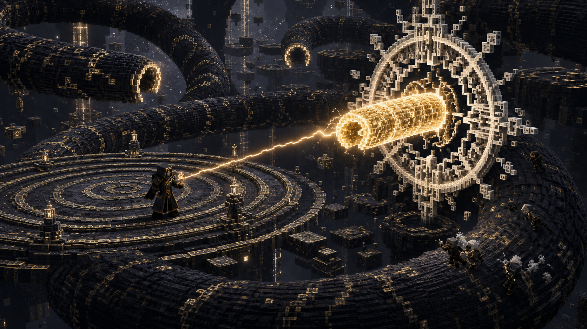

# Stage 09 — Claim: There Is No Outside

## Purpose

Deliver the Relation-focused portion of the main duel. Yaldabaoth asserts that
all space exists inside his arrangement; the player creates a relation his
body cannot consistently obey.

## Combat Flow

This Claim enters near 100–70% boss health.

- Declared coils become temporary walls with visible endpoints.
- Selected floor sectors become adjacent despite physical separation.
- Passing serpent segments rotate local gravity along their surface.
- Firmament anchors appear at stable positions outside the current coil.
- One exposed body segment becomes a valid Relation subject.

The player links the exposed segment to a firmament anchor. Yaldabaoth's next
declared burrow or charge must continue rather than cancel. The linked segment
arrives where the rest of the body cannot follow, becomes a contradiction
segment, and opens a high-value damage window.

## Safety and Readability

- Coil walls cannot seal every participant into a damage zone.
- Folded sectors show both endpoints before adjacency activates.
- Gravity transitions use existing MnAGnosis gravity safety and camera
  clearance rules.
- Anchors remain valid for long enough to support solo targeting.
- A missed relation returns to the ordinary combat loop without healing the
  boss or resetting the act.

## Party Scaling

Additional participants may create more folded sectors, overlapping segment
paths, or shorter contradiction windows. The solution still requires only one
valid link and never requires players on both endpoints.

## Verification

- Link, charge, contradiction, and recovery transitions are deterministic.
- Gravity changes do not eject players through the arena boundary.
- A segment cannot become contradictory twice from one link.
- Invalid anchors and stale segment references reject safely.
- Restart recovery preserves or cleanly cancels the active relation.
- Ordinary segment damage remains possible throughout.

## Handoff

Once introduced, this Claim remains available to the overlap controller in
[Stage 12](12-claims-and-crown-transition.md).
